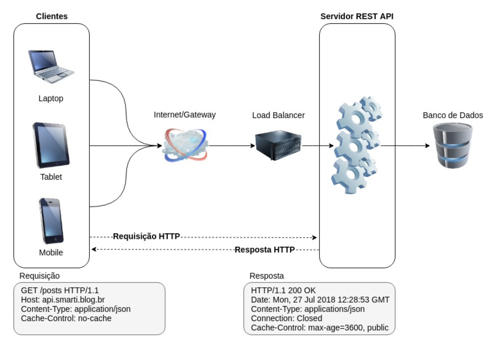

# API REST

### Índice

1. O que são API, REST e RESTful?
2. O que é API Rest?
3. Princípios do REST
4. Ações
   1. URI
   2. Métodos HTTP
   3. Códigos de Status HTTP
5. Representações
6. Referências Bibliográficas

### O que são API, REST e RESTful?

Vamos entender o que são e como funcionam API, REST e RESTful.

#### API

É uma interface de usuário que é consumida por uma aplicação e permite que funcionalidades sejam utilizadas sem conhecimento da implementação de software.

#### REST 

É um estilo arquitetural para desenvolvimento de _s_erviços web baseado no protocolo HTTP.   
São princípios e regras que permitem a criação de projetos com interfaces bem definidas, permitindo que aplicações se comuniquem.

#### RESTful

Os sistemas que utilizam os princípios REST são chamados RESTful, ou seja, é a capacidade de determinado sistema aplicar os princípios de REST.

### Princípios do REST

Para que uma arquitetura seja considerada **RESTful**, um conjunto de regras e princípios devem ser seguidos:

* **Cliente-Servidor**: A separação das responsabilidades é o princípio por trás do cliente-servidor. Ao separar a interface de usuário \(UI\) do armazenamento de dados, é possível melhorar a portabilidade através de múltiplas plataformas de UI, simplificar os componentes do servidor, e permitir a evolução de forma independente uma vez que não há dependência entre os lados cliente/servidor. 
* **Interface Uniforme**: A característica principal que diferencia o estilo arquitetural REST dos demais é uma interface uniforme entre os componentes cliente e servidor. Como o cliente e servidor compartilham esta interface, deve-se ter um “contrato” bem definido para comunicação entre os lados.  Há quatros princípios para obter uma interface uniforme:  Identificação dos Recursos, Representação dos recursos, Mensagens auto-descritivas e Hypermedia. 
* **Stateless**: A comunicação entre cliente-servidor deve ocorrer independente de estado, cada requisição deve possuir toda informação necessária para que seja inteiramente compreensível.  
* **Cache**: O cache ajuda a melhorar a performance, a escalabilidade e eficiência uma vez que reduz o tempo de resposta médio quando comparado entre uma série de interações cliente-servidor. As diretivas de cache são controladas pelo servidor através do cabeçalho HTTP. 
* **Camadas**: Arquitetura deve ser construída através de camadas gerenciadas de forma independente, onde mudanças de uma camada não devem impactar nas demais.  A grande vantagem de trabalhar em camadas é que a arquitetura se torna menos complexa e fica mais propensa a mudanças.

### Ações

Utilizamos **verbos** para nomear a ação desejada a ser realizada no recurso identificado \(API REST\).

**URI**

É a interface de comunicação entre cliente-servidor de sua API REST. É através dele que é possível acessar os recursos da aplicação, ou seja, a API REST vai prover uma url base que vai utilizar os métodos HTTP para indicar as ações requisitadas.

#### Métodos HTTP

Um dos princípios de uma arquitetura RESTful é a manipulação dos recursos através de métodos HTTP.  Os métodos HTTP vão indicar qual ação está sendo requisitada pelo consumidor de um determinado serviço.  
Os principais métodos HTTP utilizados são os método que representam as operações **CRUD.** 

| **Verbo HTTP** | Descrição | Resposta |
| :---: | :---: | :---: |
| **POST** | Criar um Recurso | Pode retornar o link\(id\) para o  novo recurso |
| **GET** | Ler um Recurso | Retorna a resposta no formato  solicitado. |
| **PUT** | Alterar um Recurso | Pode retornar ou não o recurso. |
| **DELETE** | Excluir um Recurso | Pode retornar o objeto deletado  ou não \(204\) |

#### Códigos de Status HTTP

Os códigos de status indicam a situação de uma requisição à API REST e é exibida na mensagem de retorno \(Response\).

| Categoria | **Descrição** | Exemplos |
| :--- | :--- | :--- |
| 1xx | Mensagens informativas | 100, 102 |
| 2xx | Indicação de que a Requisição foi recebida  com Sucesso | 200, 201, 204 |
| 3xx | Indicação de Redirecionamento | 307 |
| 4xx | Indicação de Erro por parte do Cliente | 400, 401, 403, 415 |
| 5xx | Indicação de Erro por parte do Servidor | 500 |

### Representações 

Quando fazemos uma requisição para um serviço web_,_  os dados retornados podem ser em qualquer formato.   
Atualmente os mais conhecidos são JSON e  XML.  
Há 3 formas de especificar o formato dos dados a serem retornados durante a requisição à API REST. 

| Descrição | Especificação |
| :---: | :---: |
| Parâmetros de Query | /contribuintes/{id}?format=xml  /contribuintes/{id}?format=json |
| Sufixo | /programmes/schedules/fm/today.xml /programmes/schedules/fm/today.json |
| HTTP Header Accepts | Accepts: application/xml  Accepts: application/json |

### Referências Bibliográficas 

\[1\] [https://becode.com.br/o-que-e-api-rest-e-restful/](https://becode.com.br/o-que-e-api-rest-e-restful/)  
\[2\] [https://www.hostgator.com.br/blog/api-restful/](https://www.hostgator.com.br/blog/api-restful/)  
\[3\] [https://www.smarti.blog.br/api-rest-principios-boas-praticas-para-arquiteturas-restful/](https://www.smarti.blog.br/api-rest-principios-boas-praticas-para-arquiteturas-restful/)  
\[4\] [https://www.devmedia.com.br/servicos-restful-verbos-http/37103](https://www.devmedia.com.br/servicos-restful-verbos-http/37103)  
\[5\] [https://blog.mbeck.com.br/api-rest-e-os-verbos-http-46e189085e21](https://blog.mbeck.com.br/api-rest-e-os-verbos-http-46e189085e21)

