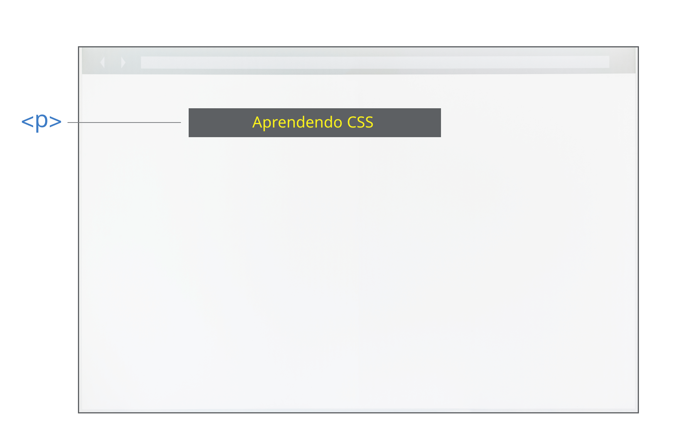
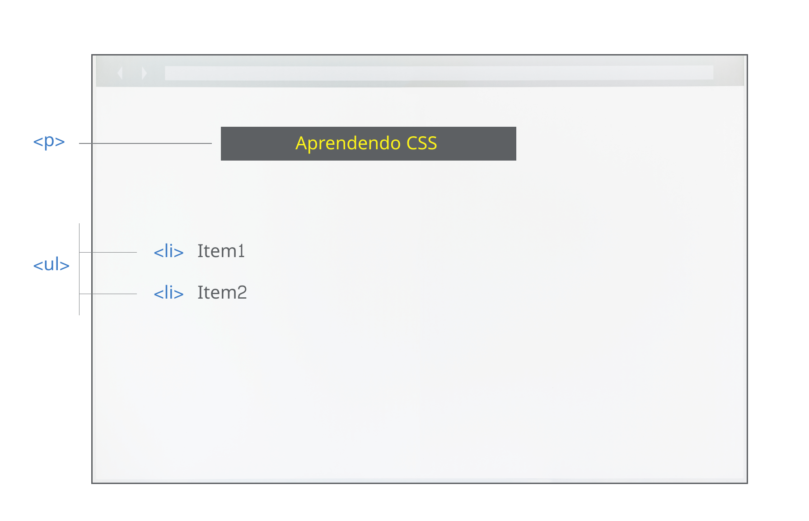
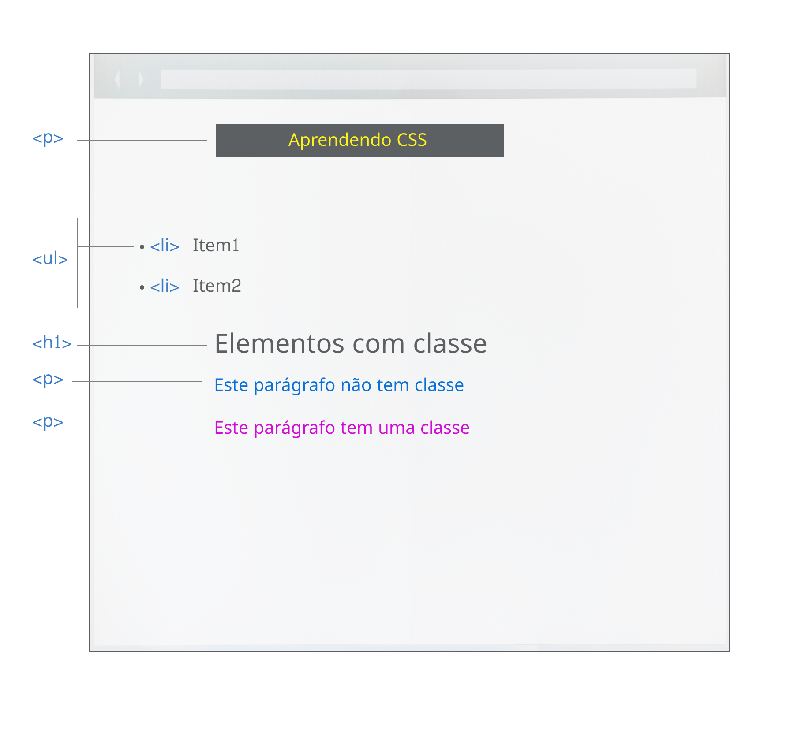
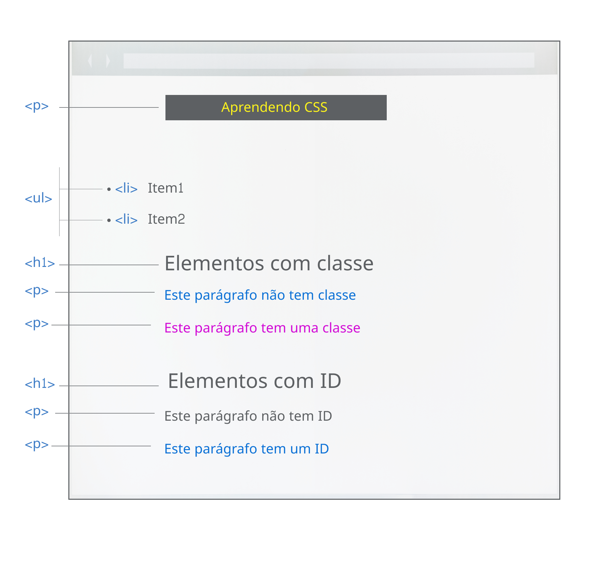
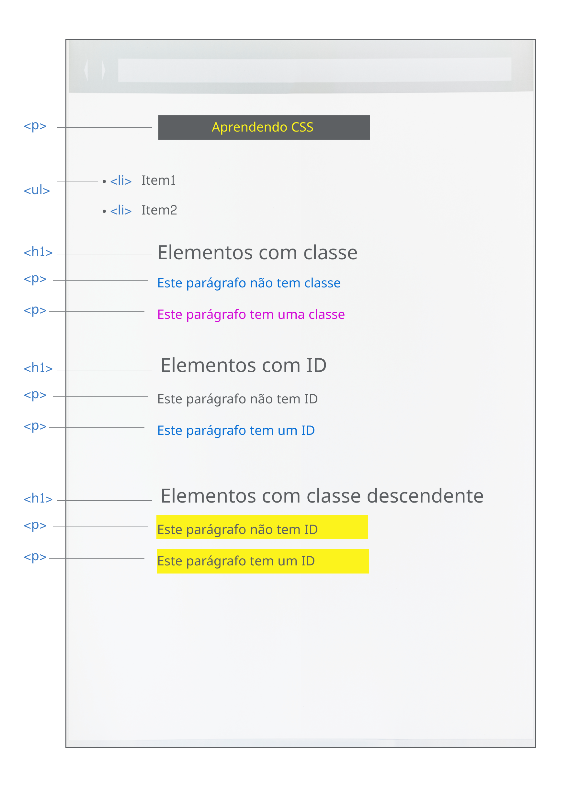
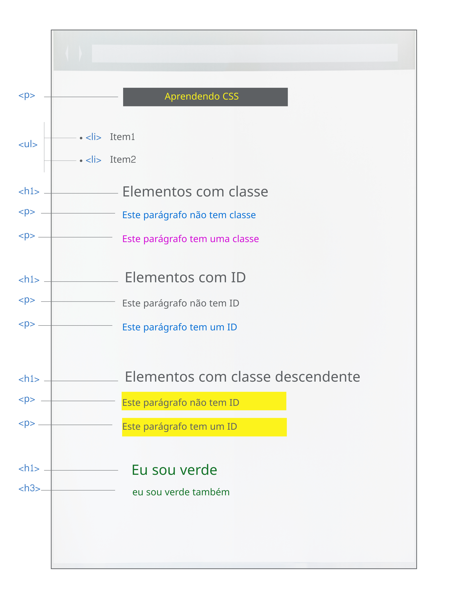
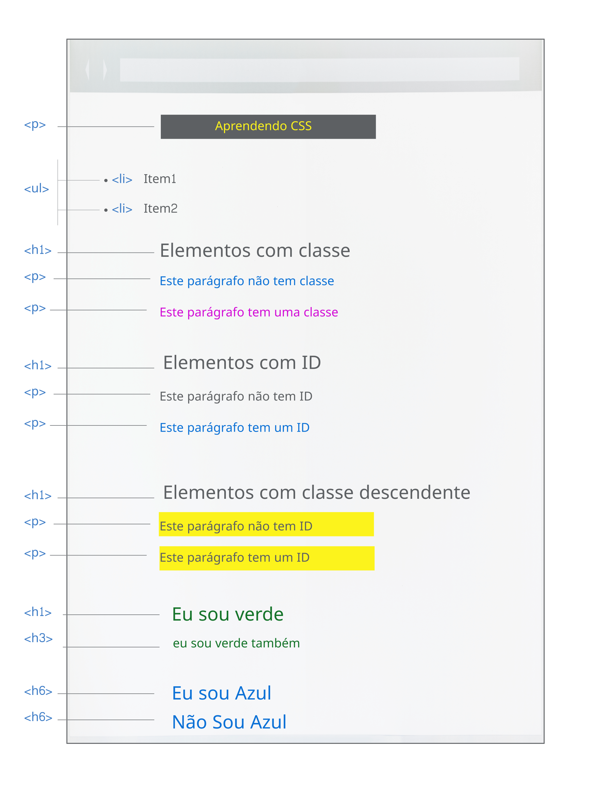
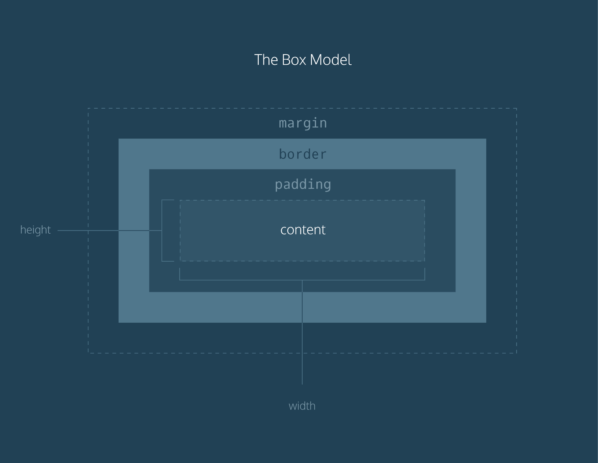
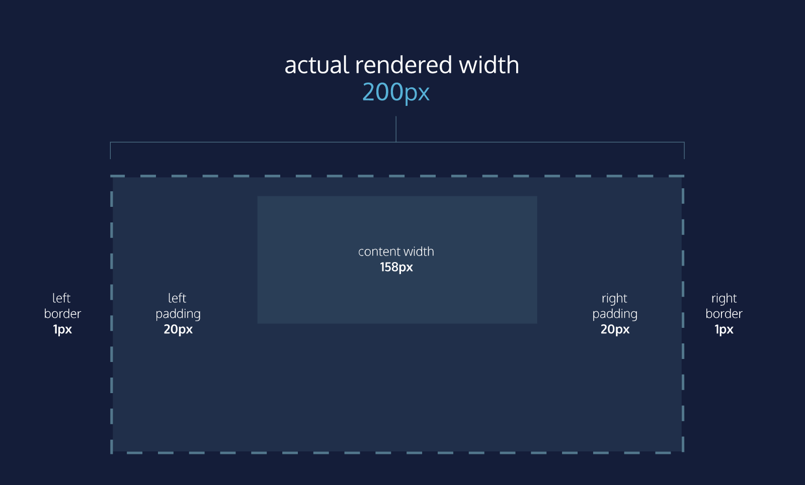
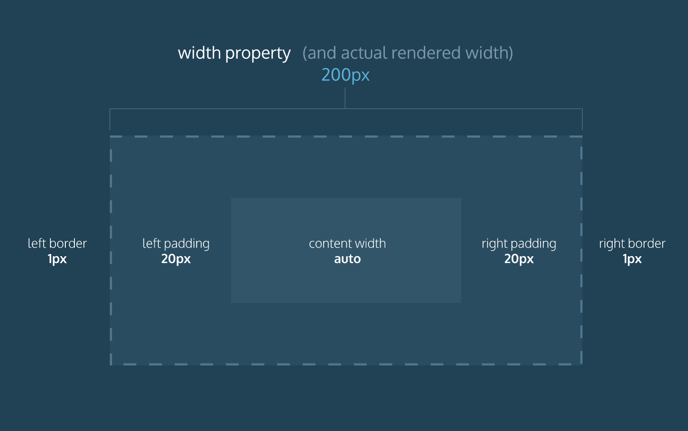

# CSS

## O que é CSS?


**CSS** \(Cascading Style Sheets\) é uma linguagem declarativa que controla a apresentação visual de páginas web em um **navegador**. O navegador aplica as declarações de estilo CSS aos elementos selecionados para exibi-los apropriadamente. Uma declaração de estilo contem as propriedades e seus valores, que determinam a aparência de uma página web.

Para começar, você deve criar uma pasta chamada css e dentro dela, você irá criar um arquivo chamado _**style.css**_


## Adicionando CSS no seu HTML

Podemos adicionar o nosso CSS ao documento HTML de três maneiras:

### Tag &lt;style&gt;

Podemos usar a tag `<style>` para estilizar nossas páginas. Só precisamos adicionar a tag dentro do nosso `<head>` no documento HTML.

```markup
<!DOCTYPE html>
<html lang="en">
<html>
  <head>
  <!-- Adicionando a tag style para estilizar a página -->
    <style>
      .box-red {
        background-color: black;
        width: 100px;
        height: 100px;
      }
    </style>
  </head>
  <body>
    <div class="box-black">
     <p>BOX</p>
    </div>
  </body>
</html>
    
```

### Style Inline

O atributo _style_, também conhecido como style inline, é um atributo que usamos dentro das nossas tags para estilizá-las. Para utilizarmos, basta adicionarmos o atributo style dentro da nossa tag no HTML.

```markup
<html>
  <head>
    <title>CSS Inline</title>
  </head>
  <body>
    <div class="box-black">
    <!-- Adicionamos o atributo style aqui para podermos 
    estilizar nossa tag -->
     <p style="color:black;">BOX</p>
    </div>
  </body>
</html>
```

### Style externo -  Usando o `<link>`

Essa é a mais recomendada forma de trabalhar com o CSS e consiste em usar a tag `<link>` para fazermos uma ancoragem entre nosso documento HTML e nosso arquivo .css

```markup
<html>
  <head>
   <!-- Aqui adicionamos a tag link, com referência para 
   nosso arquivo CSS -->
   <link rel="stylesheet" href="css/style.css">
  </head>
  <body>
    <div class="box-red">
     <p style="color:red;"> Box </p>
    </div>
  </body>
</html>
```

Na tag [`<link>`](https://developer.mozilla.org/en-US/docs/Web/HTML/Element/link)  são passados dois atributos:

* `rel="stylesheet" :`diz ao browser que temos uma "folha de estilos" \(stylesheet\) 
*  `href="css/style.css` : é a referência de onde eu arquivo de estilos está \(nesse caso, está na pasta css e o arquivo se chama _style.css_

O Link do CSS sempre deve ser colocado _abaixo_ da tag **`<title>Document</title>`** 

## Seletores CSS

Uma regra CSS é um conjunto de **propriedades** associados a um **seletor**. 


#### Seletor \(Selector\)

O nome do elemento HTML no começo do conjunto de regras. Ele seleciona o\(s\) elemento\(s\) a serem estilizados \(nesse caso, elementos [`<p>`](https://developer.mozilla.org/pt-BR/docs/Web/HTML/Element/p)\). Para dar estilo a um outro elemento, é só mudar o seletor.

#### Declaração \(Declaration\)

Uma regra simples como `color: red;` especificando quais das **propriedades** do elemento você quer estilizar.

#### Propriedades \(Property\)

Forma pela qual você estiliza um elemento HTML. \(Nesse caso, `color` é uma propriedade dos elementos [`<p>`](https://developer.mozilla.org/pt-BR/docs/Web/HTML/Element/p).\) Em CSS, você escolhe quais propriedades você deseja afetar com sua regra.

#### Valor da propriedade \(Property value\)

À direita da propriedade, depois dos dois pontos, nós temos o **valor de propriedade**, que escolhe uma dentre muitas aparências possíveis para uma determinada propriedade \(há muitos valores `color(cor)` além do `red(vermelho)`\).

#### Note outras partes importantes da sintaxe:

* Cada linha de comando deve ser envolvida em chaves \(`{}`\).
* Dentro de cada declaração, você deve usar dois pontos \(`:`\) para separar a propriedade de seus valores.
* Dentro de cada conjunto de regras, você deve usar um ponto e vírgula \(`;`\) para separar cada declaração da próxima.

Aqui está um exemplo que faz com que todos os parágrafos HTML fiquem amarelos num fundo preto:

```markup
<!DOCTYPE html>
<html>
  <head>
    <title>Curso Front-End</title>
  </head>
  <body>
    <p>Aprendendo CSS.</p>
    <ul>
      <li>Item 1</li>
      <li>Item 2</li>
    </ul>
  </body>
</html>

```

```css
/* O seletor "p" indica que todos os paragrafos no documento 
serão afetados por essa regra */

p {
  color: yellow;
 background-color: gray;
}

/* A propriedade "color" define a cor do texto, neste caso 
  amarelo. */
  
/* A propriedade "background-color" define a cor ao fundo, 
  neste caso preto. */
  
```



 Você pode adicionar múltiplos seletores de uma vez, separando com uma vírgula. Se você quiser que todos os parágrafos e todas as listas tenham a cor verde, deve ser feito assim:

```css
p, li {
    color: gray;
    }
```

## Mudando o comportamento de um elemento

Quando usamos a tag &lt;li&gt; ela tem um comportamento padrão de:


Usando a propriedade list-style, você modificar o marcador \(deixá-lo como ponto, como quadrado, entre outros\) e pode fazê-lo desaparecer usando o valor `none`.  
Veja mais : [`list-style-type`](https://developer.mozilla.org/en-US/docs/Web/CSS/list-style-type) 

```css
li {
    list-style: none;
    }

```



## Adicionando uma classe `.classname` 

Até agora vimos como estilizar os elementos com base em seus nomes de elementos de HTML e isso funciona se todos os parágrafos, títulos e listas do site tiverem o mesmo estilo. Na maioria das vezes, esse não é o caso e, portanto, você precisa encontrar uma maneira de selecionar um subconjunto dos elementos sem alterar os outros. A maneira mais comum de fazer isso é adicionar uma classe ao elemento HTML. 

Com a classe permite atribuir formatação a VÁRIOS elementos de uma vez só.

```markup
 <div>
     <h1>Elementos com classe</h1>
     <p>Este parágrafo não tem classe</p>
     <p class="paragrafo">Este parágrafo tem uma classe</p>
 </div>
```

No CSS, nós vamos referenciar a classe deste modo:

```css
h1 {
    color: #5D6063
}

p {
    color: #0C71D6;
}

.paragrafo {
    color: #D20CD6;
}
```



## Seletores ID `#idname`

Crie um ID e anexe-o a uma tag HTML para fazer com que o estilo apareça.

As ids são uma forma de identificar um elemento, e devem ser ÚNICAS para cada elemento ou seja  Cada elemento pode ter apenas um ID. IDs são os estilos mais específicos e substituentes de elementos e classes. Atualmente, os IDs não são usados em CSS.

```markup
 <div>
     <h1>Elementos com ID</h1>
     <p>Este parágrafo não tem ID</p>
     <p id="paragrafocomID">Este parágrafo tem um ID</p>
 </div>
```

```css
h1 {
    color: #c1c1c1;
}

p {
    color: royalblue;
}

#paragrafocomID {
    color: black;
}
```



## Seletores Descendentes `.classname element {}`

Essa é uma combinação de uma ou mais classes, IDs ou elementos, separados por espaços, para indicar um relacionamento familiar.

```markup
 <article class="seletor_desc">
     <h1>Elementos com ID</h1>
     <p>Este parágrafo não tem ID</p>
     <p>Este parágrafo tem um ID</p>
 </article>
```

```css
.seletor_desc h1{
    color:  #5D6063;
}

.seletor_desc p{
  background-color: yellow;
  color: #5D6063;

}
```



## Agrupando Seletores

Vamos colocar o H1 e o H3 na cor: Verde

```css
 <article>
     <h1>Eu sou verde</h1>
     <h3>Eu sou verde também</h1>   
 </article>
```

```css
h1, h3 { color: green; }
```



Vamos colocar  a cor **Azul**  na tag`H6` que está dentro `<section>` :

```markup
<section>
  <h6>Eu sou Azul</h6>
</section>
<h6>Não Sou Azul </h6>
```

```css
section h6 { color: #0C71D6; }
```



## Fontes e Textos

Agora que exploramos algumas noções básicas de CSS, vamos começar a adicionar mais regras e informações no nosso arquivo`style.css` para deixar nosso exemplo bonito. Vamos começar fazendo nossas fontes e textos parecerem um pouco melhores.

[https://fonts.google.com/](https://fonts.google.com/)

Existem dois jeitos de importar uma fonte para o seu projeto:

1.  Você pode usar o link no HTML
2. Você pode usar o @import no CSS

## Layout \(Box Model\)

Todos os elementos em uma página da web são interpretados pelo navegador como dentro de uma caixa. Isto é o que se entende por modelo de caixa. Por exemplo, quando você altera a cor de fundo de um elemento, altera a cor de fundo de sua caixa inteira. Portanto cada elemento HTML, `<h1>...<h6>`, `<p>,` `<ul><ol>`, `<form>`, `<div> considere que encontra-se dentro de uma caixa.`

**Vamos ver o exemplo abaixo:**

```markup
<h1>Introducção ao CSS</h1>

<h3>Aprendendo Box Model</h3>

<p> 
CSS (Cascading Style Sheets) é uma linguagem declarativa que controla a apresentação visual de páginas web 
em um navegador.O navegador aplica as declarações de estilo CSS aos
os elementos selecionados para exibi-los apropriadamente. 
Uma declaração de estilo contem as propriedades e seus valores,
que determinam a aparência de uma página web.
</p>

<p>
Agora que exploramos algumas noções básicas de CSS, 
vamos começar a adicionar mais regras e informações no nosso arquivo 
style.css para deixar nosso exemplo bonito. 
Vamos começar fazendo nossas fontes e textos parecerem um pouco melhores.
</p>
```

_Observando o exemplo acima, visualize cada elemento HTML  como quatro caixas empilhadas._

O "modelo de caixa CSS" é um conjunto de regras que definem como todas as páginas da Web na Internet são renderizadas. O CSS trata cada elemento do seu documento HTML como uma "caixa" com várias propriedades diferentes que determinam onde ele aparece na página. 

Como esperado, o layout CSS é baseado principalmente no _modelo de caixas_. Cada um dos blocos que ocupam espaço na sua página tem propriedades como essas:  
  
    **O que consiste em uma caixa:**

* `padding:` o espaço ao redor do conteúdo \(ex.: ao redor do texto de um parágrafo\).
* `border:` a linha sólida do lado de fora do padding.
* `margin:`o espaço externo a um elemento.
* `content:` o conteúdo da caixa.



## Height e Width:

O conteúdo de um elemento tem duas dimensões: uma altura e uma largura. Por padrão, as dimensões de uma caixa HTML são definidas para conter o conteúdo bruto da caixa.  
  
a propriedade `height`e as `width`podem ser usados ​​para modificar essas dimensões padrão.

```css
p{
 width:240px;
 height:80px;
}
```

## Border:

Uma _borda_ é uma linha que envolve um elemento, como uma moldura em torno de uma pintura. Fronteiras pode ser definido com um específico `width`, `style`e `color`.  
  
`width`- A espessura da borda. Espessura de uma borda pode ser definida em pixels ou com um dos seguintes palavras-chave: `thin`, `medium`ou `thick`.  
  
`style`- O design da fronteira. Os navegadores da Web podem renderizar qualquer um dos [10 estilos diferentes](https://developer.mozilla.org/en-US/docs/Web/CSS/border-style#Values) . Alguns destes estilos incluem: `none`, `dotted`, e `solid`.  
  
`color`- a cor da borda. Os navegadores da Web podem renderizar cores usando alguns formatos diferentes, incluindo [140 palavras-chave coloridas](https://developer.mozilla.org/en-US/docs/Web/CSS/color_value) .

```css
p{ border: 3px solid coral;}
```

No exemplo acima, a borda tem uma largura de 3 pixels, um estilo `solid`e uma cor de `coral`. Todas as três propriedades são definidas em uma linha de código.

## Border-radius:

Você pode modificar os cantos da caixa de borda de um elemento com a propriedade `border-radius`

```css
div.container {
  border: 3px solid rgb(22, 77, 100);
  border-radius: 5px;
}
```

O código no exemplo acima definirá _todos os quatro cantos_ da borda com um raio de 5 pixels \(ou seja, a mesma curvatura que um círculo com raio de 5 pixels teria\).

Você pode criar uma borda que seja um círculo perfeito, definindo o raio igual à altura da caixa ou a `100%`.

```css
div.container {
  height: 60px;
  width: 60px;
  border: 3px solid rgb(22, 77, 100);
  border-radius: 100%;
}
```

O código no exemplo acima cria um `<div>`círculo perfeito.

## Padding

O espaço entre o conteúdo de uma caixa e as bordas de uma caixa é conhecido como _preenchimento_ . O preenchimento é como o espaço entre uma imagem e a moldura ao redor. Em CSS, você pode modificar esse espaço com a propriedade `padding`

```css
div{
  border: 3px solid coral;
  padding: 10px;
}
```

O código neste exemplo coloca 10 pixels de espaço entre o conteúdo do parágrafo \(o texto\) e as bordas, nos quatro lados.  
  
Se você quiser ser mais específico sobre a quantidade de preenchimento em cada lado do conteúdo de uma caixa, poderá usar as seguintes propriedades:

1. `padding-top`
2. `padding-right`
3. `padding-bottom`
4. `padding-left`

Cada propriedade afeta o preenchimento em apenas um lado do conteúdo da caixa, oferecendo mais flexibilidade na personalização.

```css
p.content-header {
  border: 3px solid fuschia;
  padding-bottom: 10px;
}
```

no exemplo acima, o preenchimento será aplicado apenas na parte inferior.

Outra implementação da `padding`propriedade permite especificar exatamente quanto preenchimento deve haver em cada lado do conteúdo em uma única declaração.

```css
p.content-header {
  border: 3px solid grey;
  padding: 6px 11px 4px 9px; 
  /* top 6px, right 11px, bottom 4px e left 9px*/
}
```

No exemplo acima, os quatro valores `6px 11px 4px 9px`correspondem à quantidade de preenchimento em uma rotação no sentido horário. Em ordem, especifica a quantidade de preenchimento nos lados superior \(6 pixels\), direito \(11 pixels\), inferior \(4 pixels\) e esquerdo \(9 pixels\) do conteúdo.

Ao usar esta implementação da `padding`propriedade, devemos especificar um valor de preenchimento para todos os quatro lados do elemento.

No entanto, se os valores superior e inferior do preenchimento se igualarem, e os valores esquerdo e direito do preenchimento também se igualarem, você poderá usar o seguinte atalho:

```css
p.content-header{
padding: 5px 10px;
}
```

O primeiro valor `5px` define o valor de preenchimento para os lados superior e inferior do conteúdo. O segundo valor `10px`, define o valor de preenchimento para os lados esquerdo e direito do conteúdo.

### Margin

Até agora, você aprendeu sobre os seguintes componentes do modelo de caixa: conteúdo, bordas e preenchimento. O quarto e último componente do modelo de caixa é a _margem_ .

Margem refere-se ao espaço diretamente fora da caixa. A `margin`propriedade é usada para especificar o tamanho desse espaço.

```css
p {
  border: 1px solid aquamarine;
  margin: 20px;
}
```

O código no exemplo acima colocará 20 pixels de espaço na parte externa da caixa do parágrafo nos quatro lados. Isso significa que outros elementos HTML da página não podem ficar dentro de 20 pixels da borda do parágrafo.

Se você quiser ser ainda mais específico sobre a quantidade de margem em cada lado de uma caixa, poderá usar as seguintes propriedades:

1. `margin-top`
2. `margin-right`
3. `margin-bottom`
4. `margin-left`

Cada propriedade afeta a margem em apenas um lado da caixa, proporcionando mais flexibilidade na personalização.

```css
p {
  border: 3px solid DarkSlateGrey;
  margin-right: 15px;
}
```

No exemplo acima, apenas o lado direito da caixa do parágrafo terá uma margem de 15 pixels. É comum ver valores de margem usados para um lado específico de um elemento.

### Margin Auto:

A `margin`propriedade também permite centralizar o conteúdo. No entanto, você deve seguir alguns requisitos de sintaxe. Veja o seguinte exemplo:

```markup
<div class="container">
  <p>A propriedade margin também permite centralizar o conteúdo. 
  No entanto, você deve seguir alguns requisitos de sintaxe. 
  Veja o seguinte exemplo:</p>
</div>
<style>
.container { margin : 0 auto ;}
</style>
```

No exemplo acima, `margin: 0 auto;`centralizará a `div` nos elementos que os contêm. O valor  `0`define o margens superior e inferior a 0 pixels. O  valor `auto` informa ao navegador para ajustar as margens esquerda e direita até que o elemento seja centralizado dentro do elemento que o contém.

As `div`elementos no exemplo acima devem estar centralizados em um elemento que preenche a página, mas isso não ocorre. Por quê?  
  
Para centralizar um elemento, uma largura deve ser definida para esse elemento. Caso contrário, a largura da div será automaticamente definida para a largura total do elemento que a contém, como , por exemplo. Não é possível centralizar um elemento que ocupa toda a largura da página.

```markup
<div class="container">
  <p>agora vai centralizar o elemento!</p>
</div>
<style>
.container 
{ 
   margin : 0 auto;
   width: 800px;
}
</style>
```

## Minimum e Maximum Height e Width

Como uma página da Web pode ser visualizada através de exibições de tamanhos de tela diferentes, o conteúdo da página da Web pode sofrer essas alterações de tamanho. Para evitar esse problema, o CSS oferece duas propriedades que podem limitar o tamanho ou a largura da caixa de um elemento.

1. `min-width` - essa propriedade garante uma largura mínima da caixa de um elemento.
2. `max-width` - essa propriedade garante uma largura máxima da caixa de um elemento.

```css
p {
  min-width: 300px;
  max-width: 600px;
}
```

No exemplo acima, a largura de todos os parágrafos não diminuirá abaixo de 300 pixels, nem excederá 600 pixels.

O conteúdo, como o texto, pode se tornar difícil de ler quando uma janela do navegador é reduzida ou expandida. Essas duas propriedades garantem que o conteúdo seja legível limitando as larguras mínima e máxima de um elemento.

Você também pode limitar a _altura_ mínima e máxima de um elemento.

```css
p {
  min-height: 150px;
  max-height: 300px;
}
```

1. `min-height` - essa propriedade garante uma altura mínima para a caixa de um elemento.
2. `max-height` - essa propriedade garante uma altura máxima da caixa de um elemento.

No exemplo acima, a altura de todos os parágrafos não diminuirá abaixo de 150 pixels e a altura não excederá 300 pixels.

O que acontecerá com o conteúdo da caixa de um elemento se a `max-height`propriedade estiver configurada muito baixa? É possível que o conteúdo seja derramado fora da caixa,

## Overflow

Todos os componentes do modelo de caixa compreendem o tamanho de um elemento. Por exemplo, uma imagem com as seguintes dimensões tem 364 pixels de largura e 244 pixels de altura.

* 300 pixels de largura
* 200 pixels de altura
* 10 pixels preenchidos à esquerda e à direita
* 10 pixels de preenchimento na parte superior e inferior
* Borda de 2 pixels à esquerda e à direita
* Borda de 2 pixels na parte superior e inferior
* Margem de 20 pixels à esquerda e à direita
* Margem de 10 pixels na parte superior e inferior

As dimensões totais \(364 por 244 pixels\) são calculadas adicionando todas as dimensões verticais e todas as dimensões horizontais. Às vezes, esses componentes resultam em um elemento que é maior que a área que contém os pais.

Como podemos garantir que podemos visualizar todos os elementos maiores que a área contendo os pais?

A `overflow`propriedade controla o que acontece com o conteúdo que derrama ou transborda fora da caixa. Pode ser definido como um dos seguintes valores:

* `hidden` - quando definido com esse valor, qualquer conteúdo que exceda o limite será oculto.
* `scroll` - quando definido como esse valor, uma barra de rolagem será adicionada à caixa do elemento para que o restante do conteúdo possa ser visualizado rolando.
* `visible`- quando definido para esse valor, o conteúdo excedente será exibido fora do elemento que o contém. Observe que esse é o valor padrão.

```markup
<p>
No exemplo acima, se algum conteúdo do parágrafo exceder o limite (talvez um usuário redimensione 
a janela do navegador),uma barra de rolagem aparecerá para que os usuários 
 possam visualizar o restante do conteúdo.
</p>

<style>
p {
  overflow: scroll; 
}
</style>
```

No exemplo acima, se algum conteúdo do parágrafo exceder o limite \(talvez um usuário redimensione a janela do navegador\), uma barra de rolagem aparecerá para que os usuários possam visualizar o restante do conteúdo.

A propriedade overflow é configurada em um elemento pai para instruir um navegador da web como renderizar elementos filho. Por exemplo, se a propriedade overflow de uma div estiver definida como `scroll`, todos os filhos dessa div exibirão o conteúdo excedente com uma barra de rolagem.

## Redefinindo padrões

Todos os principais navegadores da Web possuem uma folha de estilo padrão que eles usam na ausência de uma folha de estilo externa. Essas folhas de estilo padrão são conhecidas como _folhas de estilo do agente do usuário_ . Nesse caso, o termo " [agente do usuário](https://en.wikipedia.org/wiki/User_agent) " é um termo técnico para o navegador.

As folhas de estilo do agente do usuário geralmente têm regras CSS padrão que definem valores padrão para preenchimento e margem. Isso afeta a maneira como o navegador exibe elementos HTML, o que pode dificultar o desenvolvimento ou o estilo de uma página da web.

Muitos desenvolvedores optam por redefinir esses valores padrão para que possam realmente trabalhar com uma lista limpa.

```css
*{ margin:0 ; padding:0;}
```

O código no exemplo acima redefine os valores padrão de margem e preenchimento de todos os elementos HTML. Geralmente, é a primeira regra de CSS em uma folha de estilo externa.

Observe que ambas as propriedades estão definidas como `0`. Quando essas propriedades são definidas como `0`, elas não requerem uma unidade de medida.

### Revisando o Modelo de caixa

abordamos as quatro propriedades do modelo de caixa: altura e largura, preenchimento, bordas e margens. Compreender o modelo de caixa é um passo importante para aprender tópicos mais avançados sobre HTML e CSS. Vamos dedicar um minuto para revisar o que você aprendeu.

1. O modelo de caixa compreende um conjunto de propriedades usadas para criar espaço ao redor e entre elementos HTML.
2. A altura e a largura de uma área de conteúdo podem ser definidas em pixels ou porcentagem.
3. As bordas circundam a área de conteúdo e o preenchimento de um elemento. A cor, o estilo e a espessura de uma borda podem ser configurados com propriedades CSS.
4. Preenchimento é o espaço entre a área de conteúdo e a borda. Pode ser definido em pixels ou porcentagem.
5. Margem é a quantidade de espaçamento fora da borda de um elemento.
6. As margens horizontais são adicionadas, portanto, o espaço total entre as bordas dos elementos adjacentes é igual à soma da margem direita de um elemento e da margem esquerda do elemento adjacente.
7. As margens verticais são reduzidas, portanto o espaço entre os elementos adjacentes verticalmente é igual à margem maior.
8. `margin: 0 auto` centraliza horizontalmente um elemento dentro de sua área de conteúdo pai, se tiver uma largura.
9. A `overflow`propriedade pode ser definida como `display`, `hide`ou `scroll`, e determina como o HTML irá renderizar o conteúdo que excede a área de conteúdo de seu pai.

## Tipos de Box Model

Existem dois tipos de modelo de caixa que você encontrará no CSS: o modelo de caixa de conteúdo e o modelo de caixa de borda.

### Content Box:

Muitas propriedades no CSS têm um valor padrão e não precisam ser definidas explicitamente na folha de estilo.

Por exemplo, o padrão `font-weight`do texto é `normal`, mas esse par de propriedade e valor geralmente não é especificado em uma folha de estilo.

O mesmo pode ser dito sobre o modelo de caixa que os navegadores assumem. Em CSS, a `box-sizing`propriedade controla o tipo de modelo de caixa que o navegador deve usar ao interpretar uma página da web.

O valor padrão dessa propriedade é `content-box`. Esse é o mesmo modelo de caixa afetado pela espessura da borda e pelo preenchimento.




Width+Padding+Border =  Tamanho da Caixa - modelo de caixa afetado pela espessura da borda e pelo preenchimento.


```markup
<h1>Hello World</h1>

<style>

* {
  box-sizing: content-box;
}

h1 {
  border: 1px solid red;
  height: 200px;
  width: 300px;
  padding: 10px;
}
/*Largura total da caixa é de 322px e altura 222px*/
/* 300+10+10+1+1 Largura*/
/* 200+10+10+1+1 Altura*/

</style>
```

## Modelo de Caixa: Border-Box

O código no exemplo acima redefine o modelo de caixa `border-box`para todos os elementos HTML. Esse novo modelo de caixa evita os problemas dimensionais existentes no modelo de caixa anterior que você aprendeu.

Neste modelo de caixa, a altura e a largura da caixa permanecerão fixas. A espessura da borda e o preenchimento serão incluídos dentro da caixa, o que significa que as dimensões gerais da caixa não mudam.  





a propriedade **width** é igual à largura real processada do elemento. A área de conteúdo é dimensionada automaticamente com base na largura restante, depois que a borda e o preenchimento são subtraídos. Segue exemplo abaixo.


```markup
<h1>Hello World</h1>

<style>

* {
  box-sizing: border-box;
}

h2 {
  border: 1px solid blue;
  height: 200px;
  width: 300px;
  padding: 10px;
}

 /*Largura total da caixa é de 300px e altura 200px*/
 /* inspecione o código no navegador e veja a diferença
 no modelo de caixa no Box Model*/
 

</style>
```


No exemplo acima, a altura da caixa permaneceria em 200 pixels e a largura em 300 pixels. A espessura da borda e o preenchimento permaneceriam inteiramente _dentro_ da caixa.


[Link com exemplo no codepen.](https://codepen.io/karinamachado/pen/LYpBEQj?editors=1100)

## Revisão: Alterando o modelo de caixa

Você aprendeu sobre uma importante limitação do modelo de caixa padrão: as dimensões da caixa são afetadas pela espessura da borda e pelo preenchimento.

Vamos revisar o que você aprendeu:

1. No modelo de caixa padrão, as dimensões da caixa são afetadas pela espessura da borda e pelo preenchimento.
2. A `box-sizing`propriedade controla o modelo de caixa usado pelo navegador.
3. O valor padrão da `box-sizing`propriedade é `content-box`.
4. O valor para o novo modelo de caixa é `border-box`.
5. O `border-box`modelo não é afetado pela espessura da borda ou preenchimento.

##  O que é Responsividade?

Sabemos que o uso de dispositivo móvel para navegar na internet está crescendo cada vez mais, sempre estão lançando novos dispositivos e a cada dispositivo temos tamanho de tela diferentes, resoluções. maneiras de visualizar seja portrait ou landscape.  
  
Diante dessa situação, quando estamos desenvolvendo nosso website, temos que fazer com que o conteúdo responda ao tamanho da tela do dispositivo, dessa forma, garantindo que o visitante do site tenha uma boa navegabilidade.   
  
Uma grande parte do processo para que seu site fique responsivo, está bem antes de implementar somente técnicas de breakpoints e consulta de mídias, para deixar o design responsivo, é interessante saber alguns princípios quando você está desenvolvendo o seu website para que seu conteúdo se apresente de uma forma bacana em todas as resoluções. 

## 1\) Responsivo x Adaptativo


### Design Responsivo.

E um design fluido, que se adapta ao tamanho da tela que deseja, independente do dispositivo, utiliza consulta de mídia css \(@screen, @print\) para alterar estilos com o foco no dispositivo desejado.


### Design Adaptativo.

Usa layouts estáticos baseados em pontos de interrupção de quebra \(breakpoint\) que não respondem até que sejam inicialmente carregados.

O adaptativo detecta o tamanho da tela e carrega o layout apropriado para ele, um site adaptável tem vários tipo de tela \( 320px, 480, 760px, 1200px, 1600px\). 

Ex: em uma tela desktop de 1366px de largura que é o padrão hoje na web, se estiver navegando um um dispositivo mobile um Android ou Iphone, uma conexão 3G ou 4G, você pode ter uma cópia de imagem e transformando em uma miniatura e nessa resolução seja exibido de acordo com a proporção do dispositivo e também em um tamanho menor ex: 320px ou 400px.

De acordo com o elemento que está trabalhando ou com a resolução você pode utilizar as duas técnicas, de uma forma que não prejudique a navegação do usuário e a aparência.

Enfim, não quer dizer que uma técnica é mais correta  ou melhor que a outra, você pode estar utilizando umas das duas em seu projeto.  


### Unidade de Medidas Relativas x Fixas


Pela imagem acima, já percebemos a diferença em usar medida relativa ou fixa no seu CSS, mas é importante saber em que momento vamos usar unidade relativa ou fixa, então se você criar um container de conteúdo, você vai utilizar porcentagem % nesse caso, afinal vai ter que encaixar dois ou mais elementos e cada um vai ter a sua proporção dentro da área útil.

Agora quando você estiver trabalhando com espaçamento interno ou externo, não é vantagem usar porcentagem % pelo motivo de renderização nos navegadores, ex: se visualizar no chrome, vai se comportar bem, porque vai conseguir interpretar. o % da margin e padding, já no firefox ou edge, como não tem um contexto fixo, uma altura por exemplo esses navegadores não vão conseguir calcular um percentual baseado no elemento.Portanto o ideal é trabalhar com unidades estáticas para espaçamento internos e externos, garantindo que o seu conteúdo fique distribuído de uma forma uniforme. 

**"em"** é uma medida relativa ao dispositivo, que no geral configura a mesma coisa que 16px. Portanto 1em == 16px, 1.2em == 19,2px...

### Breakpoints


É uma técnica que vamos utilizar muito para fazer o nosso design responsivo na nossa página, ou seja constitui na ação de redimensionar o seu navegador  e quando o conteúdo estiver fora da área, desalinhado, é onde você vai  usar ponto de quebra em uma determinada resolução e faz a alteração necessária e com isso você vai conseguir alinhar os elementos, esconder ou exibir.

A vantagem é que é totalmente flexível, embora já temos as medidas padrões que já sabemos dos dispositivos móveis seja, um android, iphone, tablet etc..., mas com o breakpoint podemos ajustar os elementos com uma nova medida.

### Valores Máximos e Mínimos


Olhando a animação acima, percebemos que utilizando a propriedade max-width, ou seja o valor máximo, quando o layout chega nesse valor o site para de esticar, o conteúdo ano vai ultrapassar a largura determinada.

A a maioria dos containers de conteúdo a dica é colocar max-width.  
  
Ex: max-width: 1300px, mas numa resolução 768px que é um tamanho de um tablet/ipad o conteúdo vai ajustar ocupando 100% da tela.

### Bitmaps x Vetores


Vetor é uma imagem que quando você expande para um tamanho grande ou pequeno ela não perde a qualidade da imagem, não distorce.

Imagem em bitmap como:  png, jpg, se tivermos uma imagem de 200px e aumentar para 800px, essa imagem será distorcida.

Mas não quer dizer que todas as imagens do meu site tem que ser em vetor , é interessante usar em logomarcas, menus e ícones. Para as imagens tipo png ou jpg é legal usar para foto de perfil, de artigo entre outros.

## Flexbox

 Foi projetado tanto como um modelo de _layout_ unidimensional quanto como um método capaz de organizar os elementos em uma interface, além de possuir capacidades avançadas de alinhamento.

#### Flex Container

O Flex Container é a tag que envolve os itens flex, ao indicar `display: flex`, essa tag passa a ser um Flex Container.

Vamos dar uma olhada neste site abaixo para exemplos!

[Guia Completo Flexbox](https://origamid.com/projetos/flexbox-guia-completo/)

## Referências

[CSS Básico](https://developer.mozilla.org/pt-BR/docs/Aprender/Getting_started_with_the_web/CSS_basico)   
https://developer.mozilla.org/pt-BR/docs/Aprender/Getting\_started\_with\_the\_web/CSS\_basico

[Como o CSS é estruturado](https://developer.mozilla.org/pt-BR/docs/Learn/CSS/First_steps/Como_CSS_e_estruturado)  
[https://developer.mozilla.org/pt-BR/docs/Learn/CSS/First\_steps/Como\_CSS\_e\_estruturado](https://developer.mozilla.org/pt-BR/docs/Learn/CSS/First_steps/Como_CSS_e_estruturado)

[Conceitos básicos de Flexbox](https://developer.mozilla.org/pt-BR/docs/Web/CSS/CSS_Flexible_Box_Layout/Conceitos_Basicos_do_Flexbox)  
[https://developer.mozilla.org/pt-BR/docs/Web/CSS/CSS\_Flexible\_Box\_Layout/Conceitos\_Basicos\_do\_Flexbox](https://developer.mozilla.org/pt-BR/docs/Web/CSS/CSS_Flexible_Box_Layout/Conceitos_Basicos_do_Flexbox)

[ORIGAMID - Conceitos Flexbox](https://origamid.com/projetos/flexbox-guia-completo/)  
[https://origamid.com/projetos/flexbox-guia-completo/](https://origamid.com/projetos/flexbox-guia-completo/)


