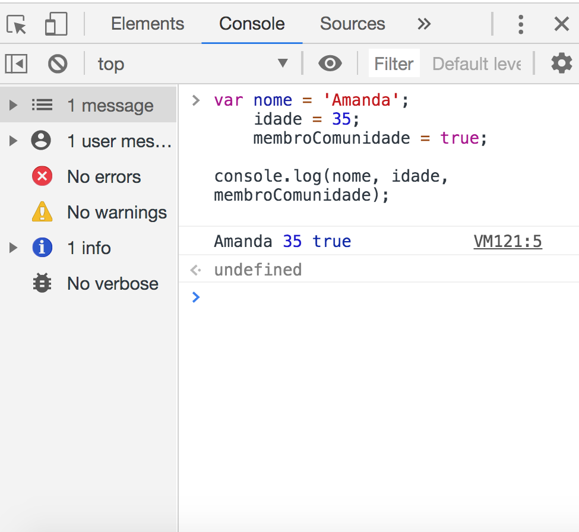

# JavaScript

Antes de estudarmos o JavaScript, vimos na aula de lógica de programação sobre os algoritmos, que é um conjunto de passos para que um programa de computador possa realizar uma tarefa, tornando os nosso programas mais rápidos.   
  
Então como vamos dar essa instrução ao nosso computador? será que ele vai executar as minhas instruções do jogo que quero criar para _**web**_ escrevendo no idioma português? a resposta é: Não, precisamos estudar um _**"idioma"**_ uma linguagem da web que o computador entenda essa instruções para que eu comece a criar o meu jogo, então vamos começar a estudar o JavaScript.

## Hello! o que é JavaScript?

JavaScript é uma linguagem de programação interpretada, isso significa que você escreve o seu programa em um arquivo .js e abre esse arquivo em um navegador ou no node.js, ele automaticamente vai ser interpretado, diferente de uma linguagem compilada que primeiro tem que compilar o código para depois executar.\(exemplo developer tools\).  
  
JavaScript está entre as linguagens de programação mais poderosas e flexíveis da web.

### **O que podemos fazer com JavaScript?**

O JavaScript foi criado para aplicações Front-End, onde faz a manipulação do DOM e comunicação assíncrona com o back-end.   
  
A linguagem permite que  você desenvolva vários tipos de projetos, desde os mais simples e complexos como: 

* Sites  [http://fancyapps.com/fancybox/3/](http://fancyapps.com/fancybox/3/) [mirrorball.com](https://mirrorball.com/) [buzzworthystudio.com](https://buzzworthystudio.com/) [ark-shelter.com](https://ark-shelter.com/)
* Aplicações web \(Gmail, Google Maps, Google Docs, Github, Slack, Linkedin\)
* Games \([ex: pacman](https://pacman.platzh1rsch.ch/), [https://play.gl/](https://play.gl/), [https://www.miumiu.com/miumiu-twist/en/](https://www.miumiu.com/miumiu-twist/en/)\)
* Animações complexas

###  Javascript e a especificação ECMAScript

Vamos entender um pouco sobre esse ECMAScript,  e para isso vamos ver rapidinho a história da linguagem, quando estamos criando algo, a primeira coisa em mente é dar o nome, para melhor identificação e o que se propõe aquele nome, ficando mais fácil para divulgar e as pessoas assimilarem.  


* Quando foi criado em 1995, por Brendan Eich,  era Mocha.
* No lançamento mudaram o nome para LiveScript 2.0 no navegador Netscape
* Acredita-se por uma estratégia de marketing quando a linguagem java \(sun microsystem\) foi lançada a netscape aproveitou o momento e mudou para JavaScript.
* Mas a Sun Microsystems havia patenteado o nome JavaScript, então o Netscape mudou para ECMAScript.
* O nome oficial de JavaScript é ECMAScript
* versões de JS contém referência ao nome da especificação como, por exemplo, “ES6” ou “ECMAScript 2015”.

Portanto desde a sua criação a linguagem vem melhorando e em cada versão implementando novos recursos, vamos abrir esse [_**link**_](https://www.w3schools.com/js/js_versions.asp) para conhecer um pouco mais. 

## Console

O console é um painel que exibe mensagens importantes, como erros, para os desenvolvedores. Grande parte do trabalho que o computador faz com nosso código é invisível para nós por padrão. Se quisermos que as coisas apareçam na tela, podemos imprimir ou _fazer logon_ diretamente no nosso console.

Em JavaScript, a `console`palavra - chave refere-se a um **objeto**, uma coleção de dados e ações, que podemos usar em nosso código. Palavras-chave são palavras incorporadas à linguagem JavaScript, para que o computador as reconheça e as trate especialmente.

Uma ação ou método incorporado ao `console`objeto é o `.log()`método Quando escrevermos `console.log()`o que colocamos dentro dos parênteses, serão impressos ou registrados no console.

```javascript
console.log(5); 
```

Este exemplo faz logon `5` no console. O ponto e vírgula indica o fim da linha ou instrução. Embora em JavaScript seu código normalmente seja executado como pretendido sem ponto e vírgula, recomendamos que você aprenda o hábito de terminar cada instrução com ponto e vírgula, para que você nunca a deixe de fora nos poucos casos em que forem necessárias.


### Tipos de Dados

O JavaScript tem seis tipos de dados primitivos:

* **Boolean:** armazena dois valores, true \(verdadeiro\) ou false \(falso\).
* **Number:** armazena números inteiros, decimais ou hexadecimais.
* **String:** armazena texto. Pode estar entre aspas simples \(’ '\), asplas duplas \("" “”\) ou backticks  \(\` \`\), ou seja os acentos graves.
* **Undefined:** quando não há nenhum valor atribuído.
* **Null:** armazena um valor vazio.
* **Symbol:** usado para realizar operações em objetos.

**\*Obs**: _Sobre  os backticks: Implementando esse tipo de dados, permite fazer interpolação de strings que permite colocar uma variável dentro do backticks._

```javascript
var nome = 'Amanda'; // string
console.log( ` o nome da membro é: ${nome}`);
```

### **Variáveis**

Responsáveis por guardar dados na memória, onde podem ser armazenados valores de diferentes tipos que podem ser números inteiros, reais, strings, booleanos, entre outros.  
  
A diferença entre **var** e **let** tem a ver com escopo vou abordar mais na frente,  Já **const**, de constante, não pode ter o seu valor modificado depois que for atribuído uma vez, ao contrário do var e let que podem ser modificados a qualquer hora.

 Ex: Sintaxe para declarar uma variável, pode iniciar com a palavra **var, let ou const**. 

```javascript
var nome = 'Amanda';
let idade = 35;
const membroComunidade = true;
```

Você pode criar mais de uma variável, sem repetir a palavra chave var.

```javascript
var nome = 'Amanda',
    idade = 35,
    membroComunidade = true;
```

```javascript
var preco = 20;
var quantidade = 5;
var precoTotal = preco * quantidade;
```

Vamos chamar essa variáveis no console do navegador para visualizar os valores.



```javascript
console.log(nome, idade, membroComunidade);
```

### Variável sem Valor

Pode declarar sem atribuir nenhum valor.

```javascript
var precoCurso; // retorna undefined
```

### Números e Operadores

Precisamos de operadores quando realizamos qualquer operação em uma linguagem de programação . A linguagem javascript também tem **operadores aritméticos**, **atribuição**, **operação** , **lógicos**, **unários,** entre outros.  


Vamos ver alguns exemplos abaixo:

> **Operadores Aritméticos** realizam aritmética em números \(literais ou variáveis\).

```javascript
// Operadores aritméticos
var soma = 100 + 50; // 150
var subtracao = 100 - 50; // 50 var multiplicacao = 100 * 2; // 200 var divisao = 100 / 2; // 50
var expoente = 2 ** 4; // 16
var modulo = 14 % 5; // 4

```

```javascript
// OPERADORES ARITMÉTICOS
var soma = 100 + 50; // 150
var subtracao = 100 - 50; // 50 var multiplicacao = 100 * 2; // 200 var divisao = 100 / 2; // 50
var expoente = 2 ** 4; // 16
var modulo = 14 % 5; // 4
var incremento = 5; console.log(incremento++); 
// 5 console.log(incremento); // 6
var decremento = 5; console.log(decremento--); 
// 4 console.log(decremento); // 4

// Vamos testar no console do navegador

console.log(soma);
console.log(subtracao);
console.log(expoente);
console.log(modulo);
console.log(incremento);
console.log(decremento);

```

```javascript
// Operadores aritméticos
var soma = 100 + 50; // 150
var subtracao = 100 - 50; // 50
var expoente = 2 ** 4; // 16
var modulo = 14 % 5; // 4
```

```javascript
// Operadores aritméticos
var soma = 100 + 50; // 150
var subtracao = 100 - 50; // 50 var multiplicacao = 100 * 2; // 200 var divisao = 100 / 2; // 50
var expoente = 2 ** 4; // 16
var modulo = 14 % 5; // 4

```

```javascript
// OPERADORES DE ATRIBUIÇÃO

 = // atribuicao
 += // atribuicao de soma = ( x = x+y)
 -= // atribuicao de subtracao = ( x = x-y)
 *= // atribuicao de multiplicacao = ( x = x*y)
 /= // atribuicao de divisao = ( x = x/y)
 %= // atribuicao de resto = ( x = x % y)
 
 // Vamos testar no navegador
 
 var x = 10;
 x += 5;
 x -= 5;
 x *= 5;
 x /= 5;
 x 5= 5;
 
var txt1 = "Programa Start";
txt1 += "impactando vidas";
```

```javascript
// Números
var idade = 28;
var gols = 1000;
var pi = 3.14; // 
```

```javascript
// Números
var idade = 28; // número inteiro
var gols = 1000;
var pi = 3.14; // número decimal
```

> _Exemplo abaixo: Lembrando que soma + em Strings serve para concatenar._

```javascript
var soma = '100' + 50; // 10050
var subtracao = '100' - 50; // 50
var multiplicacao = '100' * '2'; // 200
var divisao = 'Comprei 10' / 2; // NaN (Not a Number)
```

```javascript
// OPERAÇÃO DE COMPARAÇÃ0

//IGUALDADE
== // igualdade ao valor
=== // igual a tanto o valor quanto ao tipo.

//DIFERNÇA
!=  // Diferente de tipo
!== // Diferente de tipo e valor

// MAIOR/MENOR
> // maior que
>= // maior ou igual a 
< // menor que 
<= // menor ou igual

// Vamos testar no console do navegador!

console.log ("igualdade");
console.log ( 3 == "3"); // true
console.log ( 3 === "3"); // false
console.log ( "b" === "B");  // false *case sensitive
console.log ( "b" == "B");  // false *case sensitive

console.log ("diferança");
console.log ( 5 != "5");
console.log ( 5 !== "5");
console.log ( "c" !== "C");

console.log("maior")

console.log (3 > 1);
console.log (3 > 2);
console.log (4 > 4);
console.log (4 >= 4);

console.log("menor")

console.log (3 < 1);
console.log (3 <= 2);
console.log (4 < 4);
console.log (4 <= 4);

```

> **Operadores Lógicos** são usados ​​para determinar a lógica entre variáveis ​​ou valores.

```javascript
//OPERADORES LÓGICOS

&&	E
||	OU
!	  Negação

(x < 10 && y > 1) // é verdadeiro ou falso? 
(x == 5 || y == 5) // é verdadeiro ou falso? 
!(x == y) // é verdadeiro ou falso? 

```

### Operador Precedente

A precedência do operador descreve a ordem em que as operações são executadas em uma expressão aritmética.

```javascript
var total1 = 20 + 5 * 2; // 30
var total2 = (20 + 5) * 2; // 50
var total3 = 20 / 2 * 5; // 50
var total4 = 10 + 10 * 2 + 20 / 2; // 40

//Parênteses para priorizar uma expressão


```

> Multiplicação \( `*`\) e divisão \( `/`\) têm maior **precedência**   
> que adição \( `+`\) e subtração \( `-`\).

### Números

JavaScript tem apenas um tipo de número. Os números podem ser escritos com ou sem decimais.

### Not a Number

`NaN` é uma palavra reservada em JavaScript, indicando que um número não é um número legal.

Tentar fazer aritmética com uma sequência não numérica resultará em `NaN`\(Não é um número\)

> _É possível verificar se uma variável é NaN ou não com a função isNaN\(\)_

```javascript
//NaN = Not a Number

var numero = 80;
var unidade = 'kg';
var peso = numero + unidade; // '80kg'
var pesoPorDois = peso / 2 // NaN (Not a Number)
```

> No entanto, se a sequência contiver um valor numérico, o resultado será um número:

```javascript
var x = 100 / "10";     // x will be 10
```

> Você pode usar a função JavaScript global `isNaN()`para descobrir se um valor é um número:

```javascript
var x = 100 / "Apple";
isNaN(x); 
```

### Boolean e Condicionais

Um booleano JavaScript representa um dos dois valores: **verdadeiro** ou **falso** ou **0\(zero\)** ou **1\(um\)**

```javascript
 var possuiCursoTecnico = true; 
 var possuiGraduacao = false;
```

### Condicionais

As condicionais são usadas em partes do programa onde você quer executar certa lógica só quando certas condições são cumpridas, ou quando você quer executar uma lógica diferente para cada caso dentro do programa..

###  If e Else

É usado para condições simples.

Verifica se uma expressão é verdadeira com _**if**_ , caso contrário o _**else**_ será ativado.

```javascript
var possuiCursoTecnico = true; // variável com valor boleano true(verdadeiro)

// verifica a condicao
if(possuiCursoTecnico) { // se for verdadeiro
  console.log('Possui Curso Técnico'); // apresenta essa mensagem
} else {
  console.log('Não possui Curso Técnico');
}
// retorna "Possui Curso Técnico"
//e não executa o else.
```

> _O valor dentro dos parênteses sempre será avaliado em **false** ou **true.**_

Se o _**if**_ não for verdadeiro, ele testa o _**else if**_

```javascript
 var possuiCursoTecnico = true; 
 var possuiGraduacao = false;
 
if(possuiGraduacao) {
  console.log('Possui curso técnico e graduacao');
} else if(possuiCursoTecnico) {
  console.log('Possui curso técnico, mas não possui curso graduacao');
} else {
  console.log('Não possui curso técnico');
}

// o resultado da condicao vai mudar de acordo com o valor da variável acima.

```

### Operador Ternário

O operador ternário é muito parecido com o if e else, mas permite escrever condições de forma mais simples e direta, porque ele substitui o if/else por o ponto de interrogação "?" e logo depois, se a condição for verdadeira a primeira parte antes do : \(dois ponto\) será executada, se for falsa a segunda parte será executada.

```javascript
var possuiCursoTecnico = true;
console.log(possuiCursoTecnico ? 'possui curso técnico' : 'não possui curso técnico');
```

### Switch

O **switch** é usado para condições mais complexas, onde há a presença de várias casos independentes. verifica se uma variável é igual à diferentes valores utilizando o _**case,**_ se for igual, executa uma ação e utiliza a palavra chave _**break;**_ para cancelar a continuação. O valor default será caso nenhuma das opções forem verdadeiras.

```javascript
// Ex: app sugere o que fazer de acordo com o tempo. 

var  = 'verao';
switch (verao) { 

case 'sol':
    console.log('Vamos para a praia, está muito quente.');
break;
case 'chuva':
    console.log('Hoje está chovendo muito, vamos ver um filme');
break;
case 'frio':
    console.log('Hoje o dia está muito frio, vamos tomar um chá');
break; 

default:
    console.log('O tempo está tranquilo, vamos fazer picnic');
    
 
    
```

### 

### Função

Bloco de código que pode ser executado e reutilizado. Valores podem ser passados por uma função e a mesma retorna outro valor.

> Vamos fazer uma analogia para melhor compreensão de uma função: Ex: _**botão descongelar**_ do microondas, tem **instruções** prontas, você só precisa clicar para retornar alguma ação, você não precisou saber do passo a passo dessa instrução para descongelar uma comida, já estava pronta e já tinha um nome: ex: btDescongelar.  
>   
> Seguindo esse exemplo,  podemos imaginar uma _máquina de refrigerante_, o _caixa eletrônico do banco , controle remoto da televisão, opções de uma jogo ex: correr, pular, lutar, etc.._

### Parâmetros e Argumentos

Ao criar uma função, você pode definir  _**parâmetros**_ \(seria uma variável\) e ao executar uma função você pode passar _**argumentos** \(valores do parâmetro\)**.**_

```javascript
// temos uma funcao para calcular a area de um quadrado.
// no parentêses temos o "Parâmetro", que é uma variável.
// temos o "return" dentro do bloco, que retorna a operacao
// lado * lado ( multiplicacao). 

 function areaQuadrado(lado) { 
   return lado * lado;
}

// chamando o nome da função e colocando valor(argumentos)

//Ex:
//nomedafuncao(argumento)
areaQuadrado(4) // retorna 16  
areaQuadrado(5) // retorna 25 
areaQuadrado(2) // retorna 4

//Obs: percebe que o valor da area do quadrado muda de acordo
// com o valor do argumento quando chamo a funcao.


```


## Chamando uma função

Como  no exemplo acima, uma declaração de função  está vinculada com a palavra chave "function + nome \(\) + {as instruções que essa função vai executar }

No entanto, uma declaração de função não solicita a execução do código dentro do corpo da função, apenas declara a existência da função. O código dentro do corpo de uma função é executado ou _executado_ apenas quando a função é _chamada_ .

Para chamar uma função no seu código, digite o nome da função seguido por parênteses.  
  
Ex: areQuadrardo\( \);


> Se você ver um código em JavaScript que tem um **nome** seguido de um **parênteses**, é uma **função**. Uma função vai receber algo para retornar ou ás vezes não recebe nada, mas retorna algo também.

```javascript
//funcao para calcular o valor de pi.
//nao colocamos um parametro nessa funcao, porque nem sempre precisamos colocar um valor.
 
 function pi() { 
 
 return 3.14; // return já tem um valor
}
// criou uma variavel chamada total, chamando a funcao e colocamos um valor multiplicando
var total = 5 * pi(); // 15.7 

//Parênteses () executam uma função
```


```javascript
 // peso e altura são os parâmetros
 
function imc(peso, altura) {
 const imc = peso / (altura ** 2); 
 return imc;
}

imc(80, 1.80) // 80 e 1.80 são os argumentos, valores 
imc(60, 1.70) // 60 e 1.70 são os argumentos, valores
```

> Separar por virgula cada parâmetro, você pode definir mais de uma **parâmetro** ou nenhum também, como falamos acima.

```javascript
// Exemplo de uma função, usando condicional, if/else.

function tipoTecnologia(tecnologia){

    if(tecnologia === "html"){
    
        return "É a estrutura do site";
    }else if(tecnologia === "css"){
    
        return "Trabalha o estilo do site";
    }else if (tecnologia === "JavaScript"){
    
        return "Comportamento do site";
    
    }else{
       return "outras tecnologias";
    
    }

}

//chamando a função sem nenhum argumento
tipoTecnologia(); 
//ativando a funcao + argumento
tipoTecnologia("html")
//retorna "É a estrutura do site"
```

### Funções anônimas <a id="Fun&#xE7;&#xF5;es_an&#xF4;nimas"></a>

São funções que não tem nome, você pode atribuir a uma variável, independentemente de haver um nome para a função ou junto com algum manipulador de eventos do JavaScript, vamos ver um exemplo no código para ficar mais claro.

```javascript

var estudar = function(){
    alert("Não desista de você");
}

// a função nao tem nome, não tem parâmetro
//está dentro de uma varíavel 

//Esta função agora poder ser invocada usando:
// estudar();

```

```javascript
// usando função anônima para manipular evento de click
// quando clicar no botao, vai apresentar uma tela de alerta
// com um texto "hello"

var myButton = document.querySelector('button');

myButton.onclick = function() { 
  alert('hello');
}
```

> Não se preocupem com os métodos **querySelector**_**/addEventListener,**_  
> vamos abordar nesse curso nas próximas aulas de acordo com o nosso cronograma, o objetivo é mostrar as situações que vocês podem usar uma função anônima.

```javascript
 //Função anônima como parâmetro.
 
 addEventListener('click', function() { 
 console.log('Clicou');
});

// A função possui dois argumentos
// Primeiro é a string 'click'
// Segundo é uma função anônima
//essa função vai executar o que está dentro do bloco, caso o click ocorra.


```

### Arrow functions

O ES6 introduziu a _sintaxe da função de seta_  \(Arrow function\), uma maneira mais curta de escrever funções usando a `() =>`notação especial 

As funções de seta eliminam a necessidade de digitar a palavra chave`function` toda vez que você precisar criar uma função. Em vez disso, você primeiro inclui os parâmetros dentro do `( )`e, em seguida, adiciona uma seta `=>`que aponta para o corpo da função cercado `{ }`desta maneira:

É importante estar familiarizado com as várias maneiras de escrever funções, porque você encontrará cada uma delas ao ler outro código JavaScript. Vamos ver alguns exemplos:

```javascript
// Sem Parâmetro
const name = () => {
};
```

```javascript
// Com um Parâmetro
const name = parametroOne => {

};

// Quando a funcao tiver apenas um parametro, nao é 
// necessário ter os parênteses, mas se quiser colocar, tudo bem!
```

```javascript
// // Com dois Parâmetro
const name = (parametroOne,parametroTwo) => {

};
```

```javascript
const rectangleArea = (width, height) => {
  const area = width * height;
  return area;
};
```

### Objetos

### Arrays e Loops

### Escopo

### Expressões regulares

### Promises

### Async

### Await


### Referências Bibliográficas:

#### Guia para consultas

* [https://devdocs.io/javascript/](https://devdocs.io/javascript/)
* [https://www.w3schools.com/js/default.asp](https://www.w3schools.com/js/default.asp)
* [https://developer.mozilla.org/pt-BR/docs/Learn/JavaScript/First\_steps/O\_que\_e\_JavaScript](https://developer.mozilla.org/pt-BR/docs/Learn/JavaScript/First_steps/O_que_e_JavaScript)

