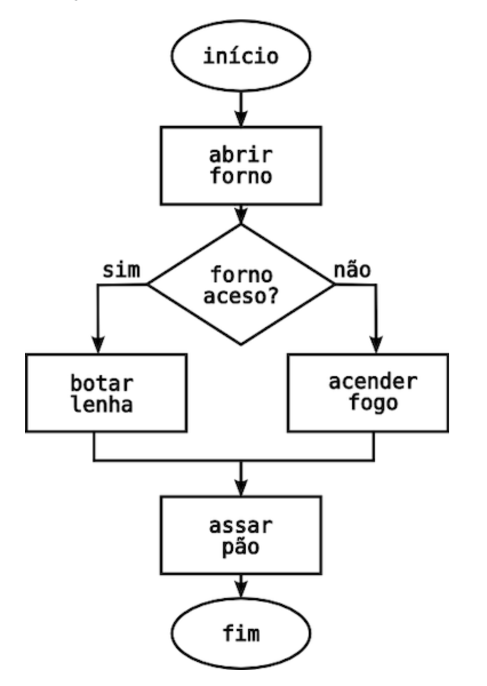

# Algoritmos, Pseudocódigos e Fluxograma

### Exercícios - Algoritmos

1. Escreva um algoritmo para uma ação que você faz no seu dia-a-dia, por exemplo, fritar ovo.
2. Escreva um algoritmo para ler as dimensões de um retângulo \(base e altura\), calcular e escrever a área do retângulo.
3. Escreva um algoritmo que leia a idade de uma pessoa em anos e escreva a idade dessa pessoa  apenas em dias. Considerar o ano com 365 dias e mês com 30 dias.
4. Escreva um algoritmo para o cálculo de média final de um aluno, para ele saber se passou de ano ou não.
   1. A média para passar de ano na escola é 7 
   2. O ano escolar tem 3 trimestres 
   3. Alunos aprovados devem ver a mensagem: Parabéns Beija-flor, você está aprovado!
   4. Alunos reprovados devem ver a mensagem: João-de-barro , você está reprovado.

### Exercícios - Pseudocódigo 

1. Escreva um pseudocódigo de um algoritmo para uma ação que você faz no seu dia-a-dia, por exemplo, fritar ovo.
2. Escreva um pseudocódigo de um algoritmo para ler as dimensões de um retângulo \(base e altura\), calcular e escrever a área do retângulo.

### Exercícios - Fluxograma

1. Desenhe um fluxogramas de um algoritmo para uma ação que você faz no seu dia-a-dia, por exemplo, fritar ovo.
2. Desenhe um fluxogramas de um algoritmo para ler as dimensões de um retângulo \(base e altura\), calcular e escrever a área do retângulo.
3. Escreva o algoritmo do fluxograma abaixo:

### Desafios

#### Elabore algoritmos e faça o fluxograma, em linguagem natural, para resolver as situações colocadas a seguir: 

1. Um homem precisa atravessar um rio com um barco que possui capacidade de transportar apenas ele e mais uma de suas três cargas, que são: um cachorro, uma galinha e um saco de milho. O que o homem deve fazer para conseguir atravessar o rio sem perder as suas cargas? 
2. Uma Torre de Hanói é formada por três discos sobrepostos transpassados por uma haste. Tendo mais duas hastes e podendo mover um disco por vez, mas nunca deixando um disco maior sobre um disco menor, como podemos passar os discos para uma outra haste? 
3. Três jesuítas e três canibais precisam atravessar um rio. No entanto dispõem apenas de um barco com capacidade para duas pessoas. Por medida de segurança não se permite que em alguma das margens do rio a quantidade de jesuítas seja inferior à quantidade de canibais. Qual a seqüência de viagens necessárias para a travessia do rio com segurança para os jesuítas?

  

